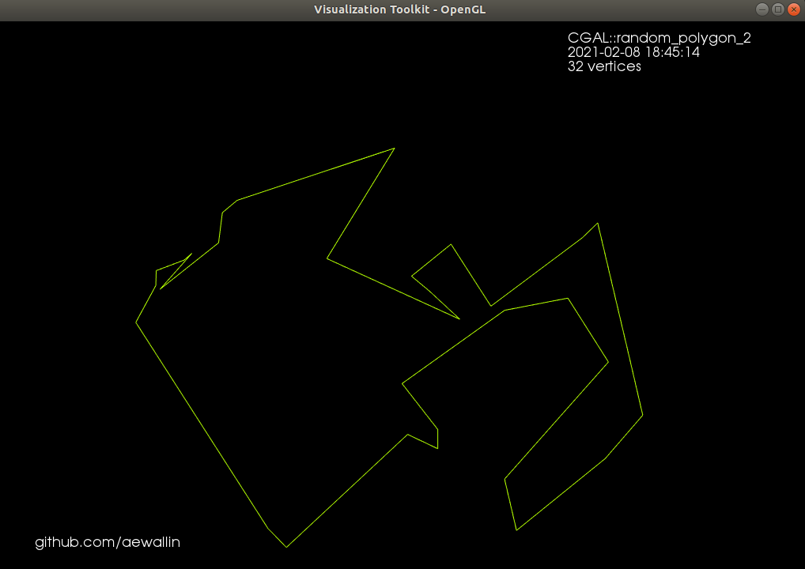

Randompolygon
=============

Anders Wallin (anders.e.e.wallin "at" gmail.com)
December 2011

This is a minimal boost::python module which wraps CGAL code 
from: http://www.cgal.org/Manual/latest/doc_html/cgal_manual/Generator_ref/Function_random_polygon_2.html
that uses the "2-opt" heuristic for generating a random polygon with N vertices.

Out-of-source build:
make bld
cd bld
cmake .
make
sudo make install

Install from PPA:
$ sudo add-apt-repository ppa:anders-e-e-wallin/cam
$ sudo apt-get update
$ sudo apt-get install randompolygon

Ubuntu 13.10 notes. There is a bug in CGAL - it looks for boost 
libraries in the wrong directory. See: 
https://bugs.launchpad.net/ubuntu/+source/cgal/+bug/1242111 This can be 
solved with two symbolic links 
sudo ln -s /usr/lib/x86_64-linux-gnu/libboost_thread.so /usr/lib/libboost_thread.so
and a similar link for libboost_system.so

todo: - generate many polygons with N vertices (using the same random 
set of points) with one call - random vertices are now hard-coded to be 
inside a unit-circle. allow
  unit-box and scaling of the radius/size-of-box.

Example polygons
================
These example random polygons are generated with the included Python script, and visualized with VTK.

32 vertex example:

1024 vertex example:

